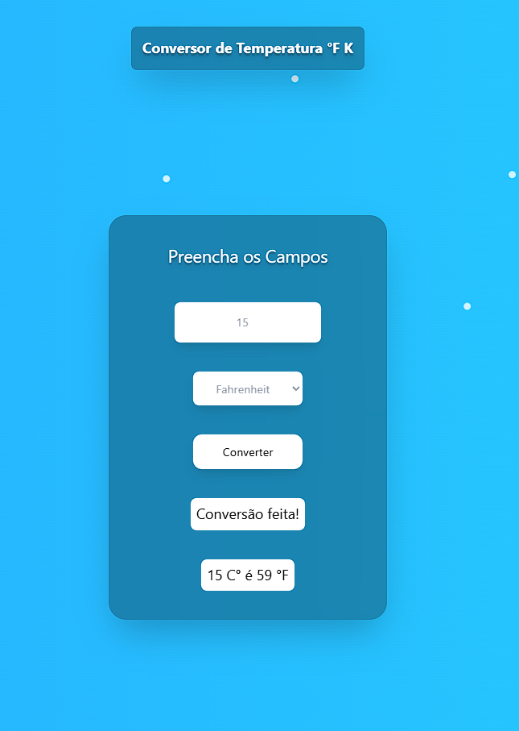
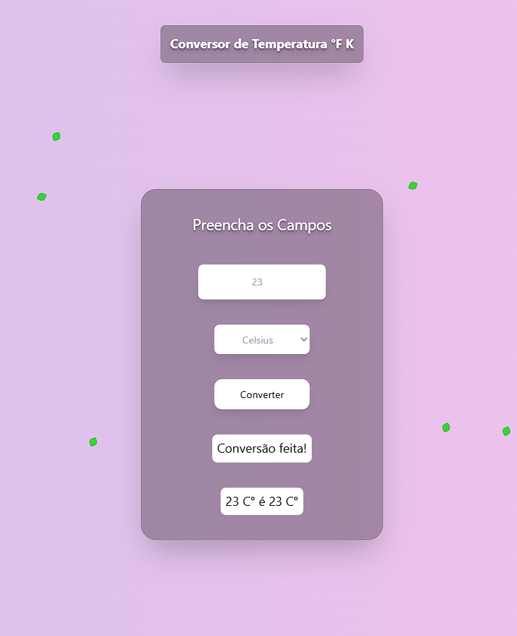
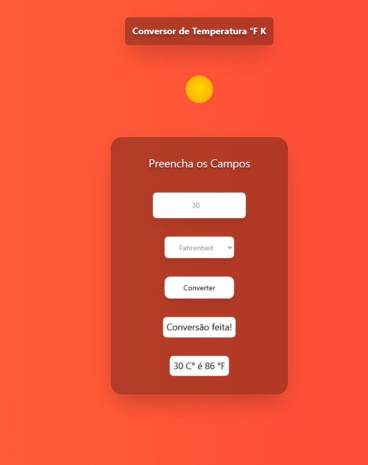

<h1>Conversor de Temperatura com Animação Climática 🌡️❄️🍂☀️</h1>

Mini projeto desenvolvido em <strong>TypeScript</strong>, <strong>TailwindCSS</strong> e <strong>HTML</strong>, que converte temperaturas entre Celsius, Fahrenheit e Kelvin, com animações de fundo que mudam de acordo com a temperatura.

<h2>Funcionalidades</h2>
<ul>
    <li>Conversão entre <strong>Celsius (°C), Fahrenheit (°F) e Kelvin (K)</strong>.</li>
    <li><strong>Animação de fundo responsiva</strong> que varia com a temperatura:
    <ul>
        <li>❄️ Frio: flocos de neve com vento.</li>
        <li>🍂 Moderado: folhas voando suavemente.</li>
        <li>☀️ Quente: solzinho com vento leve.</li>
    </ul>
    </li>
    <li>Gradientes suaves e animações contínuas.</li>
</ul>

<h2>Tecnologias utilizadas</h2>
<ul>
    <li>HTML5</li>
    <li>TypeScript</li>
    <li>TailwindCSS</li>
</ul>

<h2>Demonstração</h2>

As imagens abaixo mostram as três animações diferentes:

<table align="center">
    <tr>
        <th>Frio ❄️</th>
        <th>Moderado 🍂</th>
        <th>Quente ☀️</th>
    </tr>
    <tr>
        <td></td>
        <td></td>
        <td></td>
    </tr>
</table>

<blockquote><strong>Observação:</strong> Substitua os caminhos <code>./public/view/assets/img/frio.png</code>, etc., pelos arquivos que você capturou.</blockquote>

<h2>Como usar</h2>
<ol>
    <li>Clone este repositório:
        <!--<pre><code>git clone &lt;link-do-repo&gt;</code></pre>-->
    </li>
    <li>Instale as dependências (se necessário para Tailwind / TypeScript) ou abra diretamente o HTML no navegador.</li>
    <li>Abra <code>index.html</code> no navegador.</li>
    <li>Insira a temperatura desejada e selecione a escala.</li>
    <li>Clique em <strong>Converter</strong> e veja o resultado junto com a animação de fundo.</li>
</ol>

<h2>Estrutura do projeto</h2>
    <pre><code>/projeto-conversor
    ├─ public/
    │  ├─ styles/
    │  │  ├─ output.css
    │  │  └─ animacao.css
    │  │
    │  └─ view 
    │     ├─ assets/
    │     │  └─ img/
    │     │     ├─ frio.png
    │     │     ├─ moderado.png
    │     │     └─ quente.png
    │     │
    │     └─index.html   
    │
    └─ src/
       ├─ scripts/
       │  └─ index.ts
       │
       ├─ build/
       │  └─ index.js
       │
       └─ styles/
          └─ input.css
    </code></pre>

<h2>Observações</h2>
<ul>
    <li>A animação das partículas (flocos, folhas, sol) é gerada dinamicamente via TypeScript, e continua até que o usuário altere a temperatura.</li>
    <li>Gradientes e cores são suaves, pensados para não cansar a vista.</li>
    <li> A estilização da animação das partículas (flocos, folhas, sol) e do gradiente de fundo foi feita <strong>com CSS puro</strong>, sem utilitários do Tailwind, para maior controle sobre keyframes, partículas e transições. </li>
</ul>

